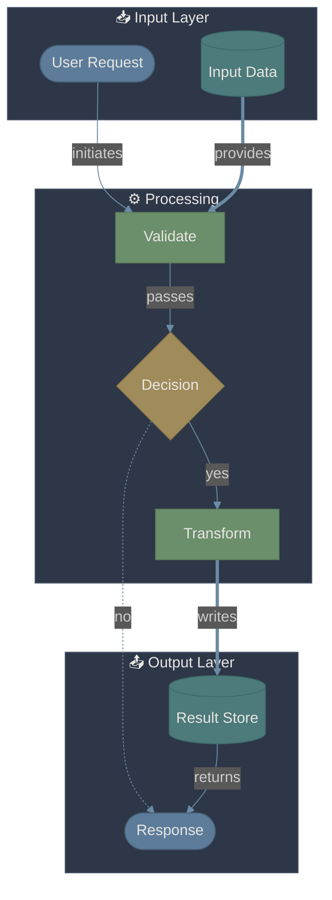
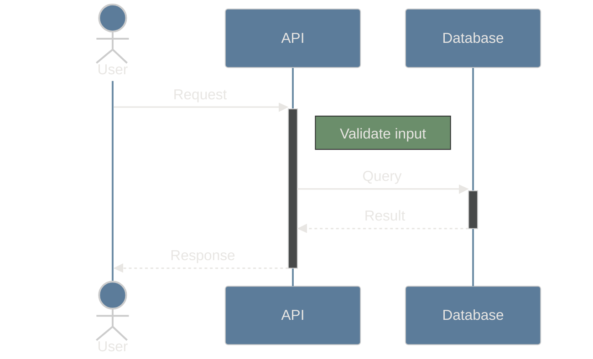
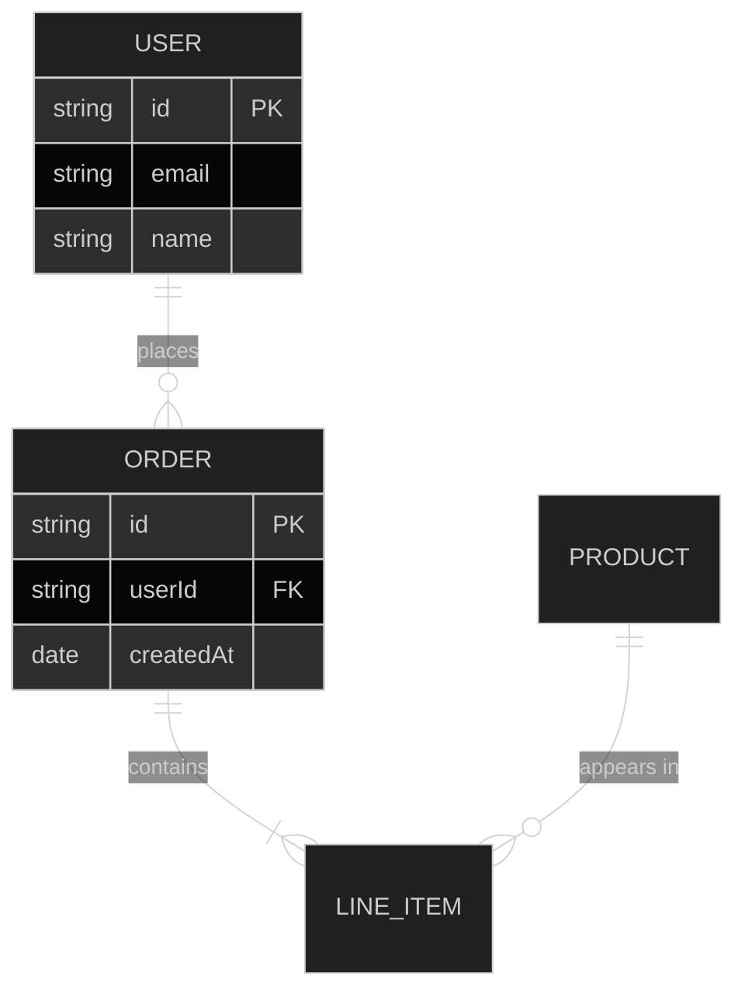

# Mermaid Diagram Design Guidelines

Create diagrams that tell a story with clear visual hierarchy, distinguishing between data/objects and relationships/operations.

## Rendering

**Always use the `renderMermaidDiagram` tool** to display diagrams. Do not output raw mermaid code blocks - the tool renders the diagram visually for the user.

> **Note:** Newlines (`\n`) in node labels do not render as line breaks. Use separate nodes or shorter labels instead of attempting multi-line text within a single node.

```
# Wrong: Just outputting a code block


# Right: Call the tool
renderMermaidDiagram(markup: "flowchart TD\n    A --> B", title: "My Diagram")
```

## Dark-Mode Color Palette

Use these calm, dark-mode friendly colors:

### Objects & Data (Nodes)
These represent static things: entities, data stores, states, actors.

| Purpose | Color | Hex | Usage |
|---------|-------|-----|-------|
| Primary Entity | Slate Blue | `#5C7C9A` | Main objects, actors |
| Secondary Entity | Muted Teal | `#4D7A7A` | Supporting data, stores |
| State/Status | Sage Green | `#6B8E6B` | States, conditions |
| External Entity | Warm Gray | `#7A7068` | External systems, users |
| Highlight Entity | Soft Gold | `#A08B5B` | Important nodes |

### Relationships & Operations (Edges/Connections)
These represent actions: data flow, transformations, calls, events.

| Purpose | Color | Hex | Usage |
|---------|-------|-----|-------|
| Data Flow | Steel Blue | `#6B8BA4` | Data movement |
| Action/Call | Dusty Rose | `#A07878` | Method calls, actions |
| Event/Trigger | Muted Purple | `#8B7B9B` | Events, triggers |
| Validation | Soft Amber | `#9B8B6B` | Checks, conditions |
| Error Path | Muted Coral | `#A07060` | Error flows, fallbacks |

### Background & Text
| Purpose | Color | Hex |
|---------|-------|-----|
| Node Background | Dark Slate | `#2D3748` |
| Text on Dark | Off White | `#E8E6E3` |
| Muted Text | Soft Gray | `#A0A0A0` |

## Spatial Organization

### Vertical Axis = Time/Sequence
- Top → Bottom: progression through time or process steps
- Group related steps at the same vertical level

### Horizontal Axis = Parallelism/Alternatives
- Left → Right: parallel processes or alternative paths
- Use subgraphs to cluster related nodes horizontally

### Depth/Layers = Abstraction
- Use subgraphs to show containment and scope
- Outer layers = higher abstraction, inner = details

## Visual Hierarchy Rules

### 1. Objects vs Operations

**Objects (Nodes)** - What things ARE:
- Use filled, rounded shapes: `([rounded])` or `[(database)]`
- Solid background colors from Objects palette
- Nouns in labels: "User", "OrderData", "Cache"

**Operations (Edges)** - What things DO:
- Use arrow styles with labels
- Styled with Operations palette colors
- Verbs in labels: "fetches", "validates", "transforms"

### 2. Shape Semantics

```
Actors/Users:      (( circle ))     or     ([stadium])
Data Stores:       [(database)]     or     [[subroutine]]
Processes:         [rectangle]      or     {diamond}
States:            ([stadium])
External Systems:  [[subroutine]]
Decisions:         {diamond}
Events:            >asymmetric]
```

### 3. Arrow Styles

```
Standard flow:     -->
Data transfer:     ==>
Async/Event:       -.->
Optional:          -.-
Strong dependency: ===
```

## Template: Flowchart



## Template: Sequence Diagram



## Template: Entity Relationship



## Storytelling Structure

### Beginning (Top/Left)
- Triggers, inputs, actors
- Use warm/inviting colors (Slate Blue, Warm Gray)

### Middle (Center)
- Processing, transformations, decisions
- Use active colors (Sage Green, Muted Teal)
- Show branching clearly

### End (Bottom/Right)
- Outputs, results, side effects
- Use concluding colors (Soft Gold for success, Muted Coral for errors)

## Quick Reference: Style Block

Copy this style block and customize node IDs:

```
    %% Objects (calm blues/greens)
    style nodeA fill:#5C7C9A,stroke:#4A6278,color:#E8E6E3
    style nodeB fill:#4D7A7A,stroke:#3D6A6A,color:#E8E6E3
    style nodeC fill:#6B8E6B,stroke:#5A7D5A,color:#E8E6E3
    
    %% Highlights (warm accents)
    style highlight fill:#A08B5B,stroke:#8A754A,color:#E8E6E3
    
    %% Subgraphs (dark containers)
    style subgraphName fill:#2D3748,stroke:#4A5568,color:#E8E6E3
```

## Link Styling

```
    %% Data flow (blue)
    linkStyle 0 stroke:#6B8BA4,stroke-width:2px
    
    %% Action (rose)
    linkStyle 1 stroke:#A07878,stroke-width:2px
    
    %% Event (purple)
    linkStyle 2 stroke:#8B7B9B,stroke-width:2px,stroke-dasharray:5
```

## Common Patterns

### Request-Response
```
User([Actor]) --> API[Process] --> DB[(Store)] --> API --> User
```

### Event Flow
```
Source>Event] -.-> Handler[Process] ==> Target[(Store)]
```

### Decision Branch
```
Input --> Check{Validate} -->|pass| Success
Check -->|fail| Error
```
